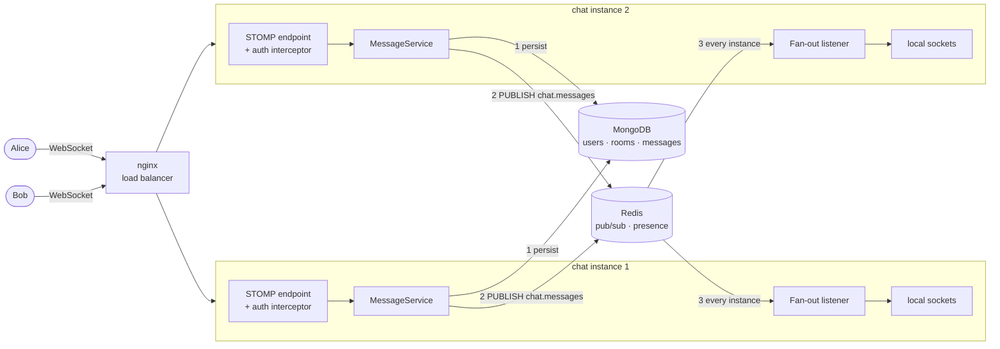
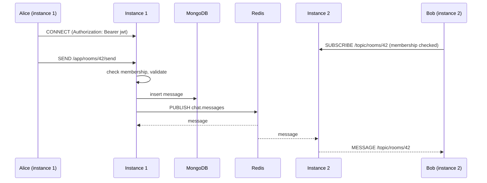

# Realtime Chat

[](https://github.com/ebrahimmorkas/realtime-chat/actions/workflows/ci.yml)


A **horizontally scalable real-time chat backend** built with Java 21 and Spring Boot 3: STOMP over WebSocket,
MongoDB for message history, and Redis pub/sub so users connected to **different server instances** can still
chat in the same room.

The hard parts of real-time systems are handled and tested: authenticating a WebSocket, stopping eavesdroppers,
delivering messages across a cluster, and tracking presence when a server crashes.

## Architecture



### Message flow



## Engineering highlights

| Challenge | Solution |
|---|---|
| Browsers can't send an `Authorization` header on the WebSocket upgrade | The JWT is sent in the **STOMP CONNECT frame**, validated by a `ChannelInterceptor` with the same `JwtDecoder` as the REST API, and bound to the session |
| Anyone could `SUBSCRIBE` to `/topic/rooms/<guessed-id>` | **SUBSCRIBE authorization**: the interceptor only lets room members subscribe to a room topic. Non-members can't post either |
| Spring's simple broker only knows its own JVM's sockets | **Redis pub/sub fan-out**: every instance publishes, and every instance delivers to its own sockets. Proven by a test that boots **two app instances** |
| "Online forever" users after a server crash | **Crash-safe presence**: a per-instance Redis hash with a TTL kept alive by a heartbeat, so a dead instance's users expire. Connections are counted per user (multiple tabs) |
| Deep history pagination is slow and shifts as messages arrive | **Cursor (keyset) pagination** on the `(roomId, _id)` index, where ObjectIds are time-ordered. Cost is constant at any depth, with no duplicates or gaps |
| Concurrent room invites overwriting each other | Atomic `findAndModify` + `$addToSet`, with "caller is a member" in the same filter, so there's no check-then-act race |
| What the client sees vs. what's stored | **Persist, then broadcast**: every message a user sees is guaranteed to be in history |

## STOMP protocol

| | Destination | Payload |
|---|---|---|
| Connect | `ws://host/ws` with CONNECT header `Authorization: Bearer <jwt>` | |
| Send | `/app/rooms/{roomId}/send` | `{"content": "Hi!"}` (1–2000 chars) |
| Receive | `/topic/rooms/{roomId}` (members only) | `{id, roomId, senderId, senderName, content, createdAt}` |
| Errors | `/user/queue/errors` (private to the sender) | `{code, message}` |

## REST API

| Method | Endpoint | Description |
|---|---|---|
| `POST` | `/api/auth/register`, `/api/auth/login` | Account and JWT |
| `GET` | `/api/users/me` | Profile |
| `POST` `GET` | `/api/rooms`, `/api/rooms/{id}` | Create and list rooms |
| `POST` | `/api/rooms/{id}/members` | Invite by email |
| `DELETE` | `/api/rooms/{id}/members/me` | Leave |
| `GET` | `/api/rooms/{id}/messages?before=&limit=` | History, newest first, cursor-paginated |
| `GET` | `/api/rooms/{id}/presence` | Members online on any instance |

Swagger UI: http://localhost:8080/swagger-ui.html

## Run it

```bash
docker compose up -d --build
```

This starts MongoDB, Redis, **two chat instances** and **nginx** on http://localhost:8080.

- Open **http://localhost:8080** in two browser windows, register two users, create a room, invite the other
  user and chat. nginx round-robins between instances (see the `X-Served-By` response header).
- Scripted proof of cross-instance delivery (Node 22+, no dependencies):

```bash
node scripts/cross-instance-demo.mjs
# Alice via http://localhost:8081 sent, Bob via http://localhost:8082 received: "Hello from instance 1!" from Alice
# Presence seen via http://localhost:8082: 2 of 2 members online
```

## Tests

```bash
./mvnw verify   # 25 tests: Testcontainers MongoDB + Redis, a real STOMP client over real sockets
```

Notable tests:
- `MultiInstanceFanoutIntegrationTest` boots a **second application instance** and verifies a message sent on
  instance A reaches a subscriber on instance B.
- `ChatWebSocketIntegrationTest` covers delivery and persistence, non-members refused on SUBSCRIBE and SEND,
  validation errors sent privately, and connections refused without a valid token.
- `PresenceIntegrationTest`: a user stays online while any tab is open, and a crashed instance's users expire.
- `MessageHistoryIntegrationTest`: 120 messages paged 50/50/20 with no gaps or duplicates, and new messages
  don't shift older pages.

## Tech stack

Java 21 · Spring Boot 3.5 · Spring WebSocket (STOMP) · Spring Security (OAuth2 resource server, JWT) ·
Spring Data MongoDB · Spring Data Redis · MongoDB 7 · Redis 7 · nginx · Testcontainers · Awaitility ·
JUnit 5 · Docker · GitHub Actions

## Design decisions and trade-offs

- **Redis pub/sub rather than a STOMP broker relay (RabbitMQ/ActiveMQ).** It's one less piece of infrastructure,
  and Redis is already there for presence. The trade-off is that pub/sub is fire-and-forget: a client that is
  disconnected at that moment misses the live message. That's acceptable here because messages are persisted
  first and clients reload history on reconnect.
- **Receive-order preservation is off.** Spring's `setPreserveReceiveOrder` dispatches frames asynchronously,
  and testing showed that stops interceptor auth failures from reaching the client as ERROR frames.
- **Room ids are unguessable, but not relied on.** Every read, subscribe and send checks membership. Non-members
  get 404 rather than 403, so rooms can't be probed.

## Roadmap

- [ ] Typing indicators and read receipts
- [ ] Per-user rate limiting on SEND
- [ ] Message edits and deletes, broadcast as events
- [ ] Kubernetes manifests with sticky-session-free scaling

## License

[MIT](LICENSE)
